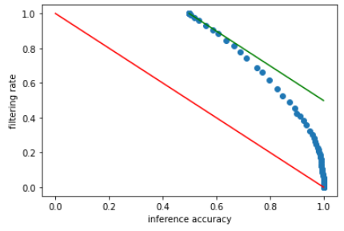

InFi is a library for building input filters for trained models to be deployed, so as to improve the resource efficiency in the inference phase.


## Installation

InFi has been tested on Python 3.7, TensorFlow 2.4, and MindSpore 1.5.

You need to install at least one of TensorFlow or MindSpore.

If you'd like to play with jupyter notebook examples, you need to install Jupyter-Lab.


## Quick Start

We use the speech recognition workload on Hollywood2 dataset as an example to show how to train and evaluate InFi-Skip.

You can download the raw data (infi_dataset_hollywood2) from [google drive](https://drive.google.com/file/d/1gXil_vQlrKirSmtyYENQ5I22p2x7CV1c/view?usp=sharing).

The full code can be found in `examples/`.

First, we need to convert the extracted .wav audio data into spectrugram:

```python
from datasets.hollywood2 import wav2spectrogram

def save_hollywood2_audio_spec(list_path, out_dir, root_path="infi_dataset_hollywood2/wav_audios/", postfix=".wav"):
    with open(list_path, "r") as fin:
        for line in fin.readlines():
            tmp = line.strip()
            wav_path = os.path.join(root_path, tmp+postfix)
            spec = wav2spectrogram(wav_path, FRAME_LENGTH=255, FRAME_STEP=128, SPEC_HEIGHT=500, SPEC_WIDTH=129)
            save_path = os.path.join(out_dir, f"{tmp}.npy")
            np.save(save_path, spec)

save_hollywood2_audio_spec("infi_dataset_hollywood2/list_train_audioclean.txt", "infi_dataset_hollywood2/spectrograms/")
save_hollywood2_audio_spec("infi_dataset_hollywood2/list_test.txt", "infi_dataset_hollywood2/spectrograms/")
```

Then we set the minimal number, say 2, of recognized words that a necessary inference requires:

```python
from datasets.hollywood2 import redundancy_speech

MIN_LEN = 2
for split in ["train", "test"]:
    speech_data =  np.load(f"infi_dataset_hollywood2/inference_outputs/speech_{split}.npy", allow_pickle=True)
    res = list()
    for d in speech_data:
        p = redundancy_speech(d)
        if p <= MIN_LEN:
            res.append([0])
        else:
            res.append([1])
    res = np.array(res)
    redundancy_ratio = 1.0 - res.sum() / len(res)
    print(split, redundancy_ratio)
    np.save(f"infi_dataset_hollywood2/redundancy_labels/speech_wnum{MIN_LEN}_{split}.npy", res)
```

Now we have prepared the data for training and testing InFi-Skip. We can easily build and train InFi-Skip models via InFi APIs:

```python
from datasets.hollywood2 import build_hollywood2_wavspec_dataset
from infi_tf import build_infi_skip, train_infi_skip

d_train = build_hollywood2_wavspec_dataset(list_path="infi_dataset_hollywood2/list_train_audioclean.txt",
                                           root_path="infi_dataset_hollywood2/spectrograms/",
                                           label_path="infi_dataset_hollywood2/redundancy_labels/speech_wnum2_train.npy")
d_test = build_hollywood2_wavspec_dataset(list_path="infi_dataset_hollywood2/list_test.txt",
                                         root_path="infi_dataset_hollywood2/spectrograms/",
                                         label_path="infi_dataset_hollywood2/redundancy_labels/speech_wnum2_test.npy")
infi = build_infi_skip(modality="audio", input_shape=(500,129,1), n_dense=200, n_layers=2, n_filters=32)
res = train_infi_skip(infi, d_train,
                      learning_rate=0.001, batch_size=32, epochs=20, val_data=d_test,
                      log_dir="logs/hollywood2_speech_wnum2/",
                      weight_dir="weights/hollywood2_speech_wnum2/")
```

Then we can evaluate the inference accuracy and filtering rate of trained InFi-Skip models:

```python
infi = load_infi_skip("weights/hollywood2_speech_wnum2/20211207-145039-Epoch20.h5")
x_test = build_hollywood2_wavspec_dataset(list_path="../datasets/Hollywood2/list_test.txt",
                                          root_path="../datasets/Hollywood2/spectrograms/").batch(10)
y_pred = infi.predict(x_test)
y_true = np.load("../datasets/Hollywood2/redundancy_labels/speech_wnum2_test.npy")

def eval_skip(y_true, y_pred, threshold=0.5):
    wrong_count = 0
    filtered_count = 0
    for y1, y2 in zip(y_true, y_pred):
        if y1[0] == 1 and y2[0] < threshold:
            wrong_count += 1
        if y2[0] < threshold:
            filtered_count += 1
    
    total_num = len(y_true)
    filtered_rate = filtered_count / total_num
    label_acc = 1. - wrong_count / total_num
    
    return label_acc, filtered_rate

TN = 1.0 - y_true.sum() / len(y_true)
acc_list = []
r_list = []
for threshold in np.arange(0., 1.01, 0.01):
    acc, r = eval_skip(y_true, y_pred, threshold)
    acc_list.append(acc)
    r_list.append(r)
```

We can plot the results:




## Citation

Mu Yuan, Lan Zhang, Fengxiang He, Xueting Tong, and Xiang-Yang Li.
2022. InFi: End-to-end Learnable Input Filter for Resource-efficient Mobilecentric Inference. In The 28th Annual International Conference On Mobile
Computing And Networking (ACM MobiCom ’22), October 24–28, 2022, Sydney,
NSW, Australia. ACM, New York, NY, USA, 14 pages. https://doi.org/10.1145/
3495243.3517016
